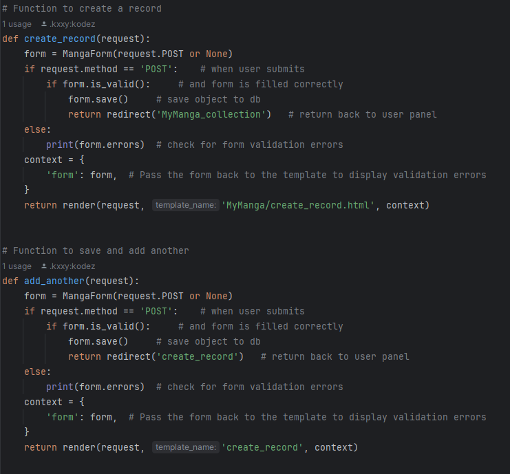
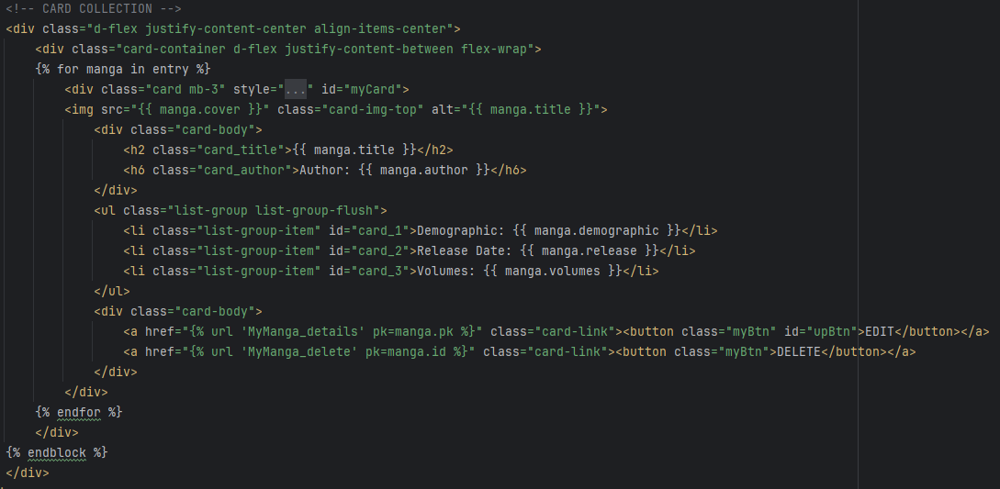
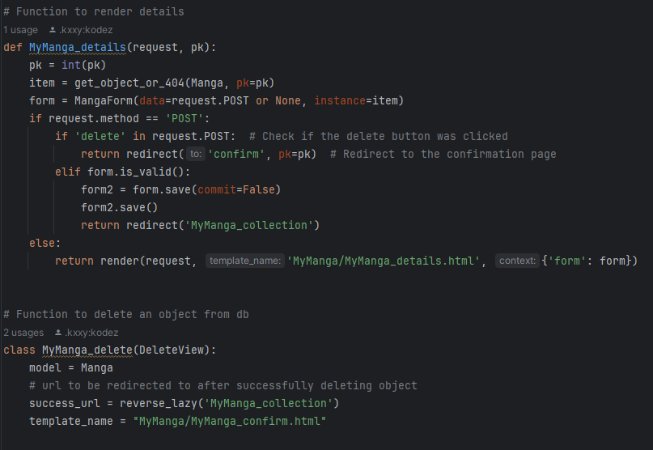
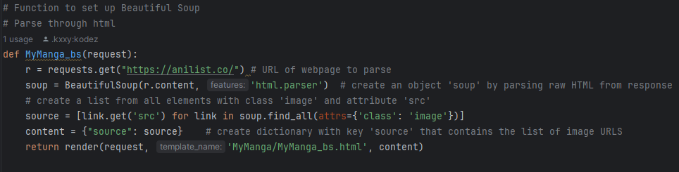
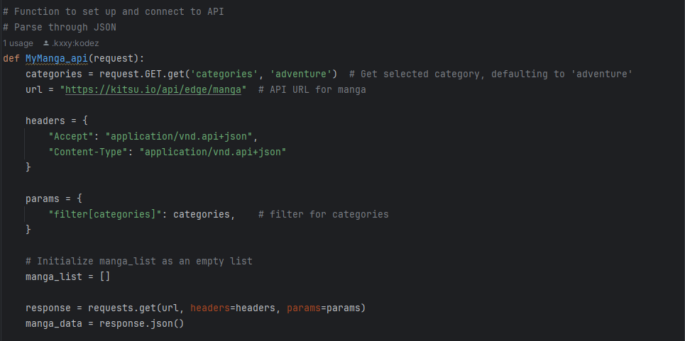
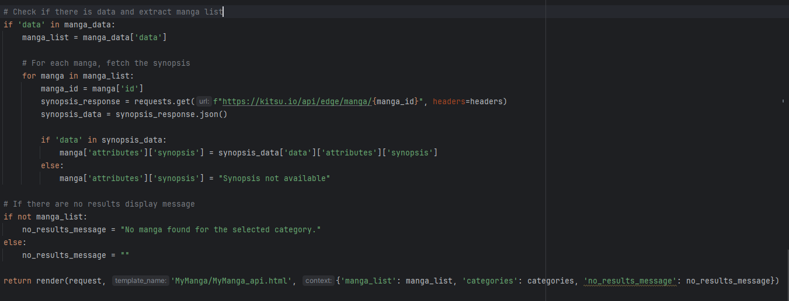
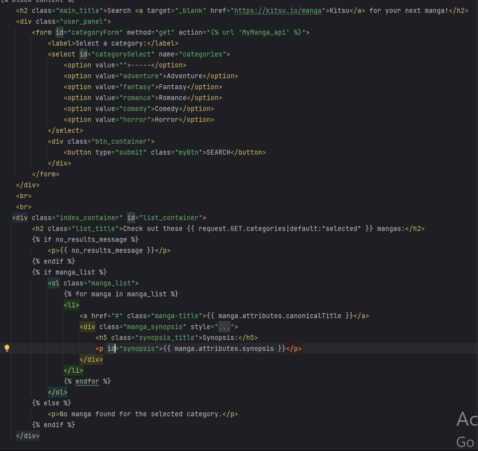
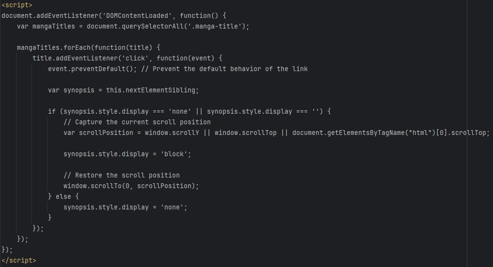
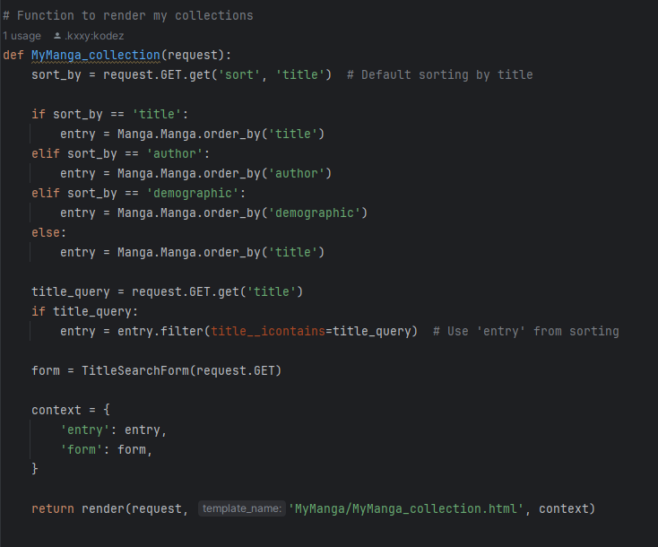
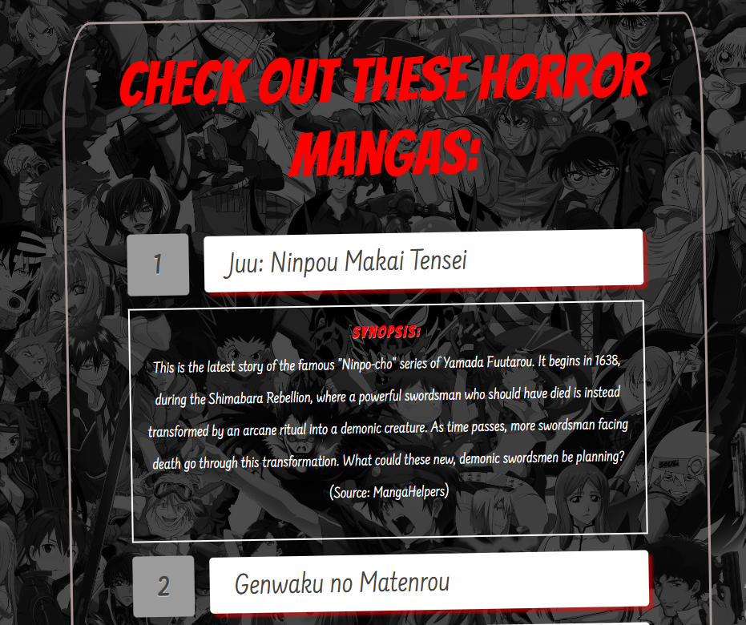

# Live-Project
<h3> Introduction</h3>

 For this project I was tasked with developing a web application for a hobbiest to store a collection of things as well as relating API and data scraped. When creating this project I wanted a place for manga enthusiast to digitally store their collection, include details on those mangas, and display their covers. My Manga came forth from those ideas as well as data scraping for covers so the user would have a source to search from for their collection. The API searches based upon category giving the user the ability to find new mangas for their collection.

The initial steps of this project were giving MyManga basic CRUD operations. The user can CREATE a record of a manga adding it to a database with the user panel. Through the collection page the user can READ those details in the form of bootstrap cards. Each card has a button with EDIT and DELETE functionality. Using BeautifulSoup cover images were scraped from Anilist for users to utilize as cover sources. I connected to Kitsu's API giving the user the ability to search for mangas. A dropdown menu with category options specifies results.

<h3>Project Stories</h3>
<ol>
  <li><a href="#crud">CRUD</a></li>
  <li><a href="ds">Data Scraping</a></li>
  <li><a href="api">API</a></li>
  <li><a href="fe">Front End</a></li>
  <li><a href="as">Additional Skills</a></li>
</ol>
  
<h4 id="crud">Create Record:</h4>

Created a form for user to insert information into database based upon object model. User has the ability to save, save and add another, and cancel returning to home page.

<h4>Read</h4>

To "read" database objects I utlized bootstrap cards. Using a for loop to scan through the db, the relevent data displays on card. Buttons for update and delete functionality. 

<h4>Update & Delete</h4>

Update button renders a details page where user can update database object. Using pk to display info from card that called funtion. The delete function initiates the confirm delete function ensuring the user doesn't accidentaly delete from the db. On successful deleteing user is returned to collection page.

<h4 id="ds">Data Scraping</h4>

Using BeautifulSoup to datascrape, I requested anilists webpage and parsed throgh the raw HTML. From the data I pulled objects with attributes class 'image' and created a dictionary with key 'source' containing object URLs.. I then linked and displayed on an HTML page.

<h4 id="api">API</h4>

This function requests the URL for chosen API by selected category. Based upon the paramaters, JSON response is stored in object manga_data.

If there's data it's extracted into manga_list. For each manga (matching our paramaters), the corresponding attribute 'synopsis' is also pulled and stored. Error handling if there is no synopsis or manga data. Information is then rendered to linked HTML page.

On the front-end I created a drop down menu for user to search API based on category. Results will then be displayed on a list. If the user clicks on list item corresponding synopsis is displayed.

JavaScript function that displays synopsis once event listener is triggered. Capturing the current scroll position, when synopsis finally loads the page will stay in its current position so user won't have to scroll back down.

<h4 id="fe">Front End</h4>

To add more user functionality I created buttons that would sort collection by title, demographic, and author. User can also use a search form to find a specific title, displaying an individual card.

Index container styled with <a href="css/styling.css">CSS</a> animation.

List and links styled with <a href="css/styling.css">CSS</a> animation.

<h4 id="as">Additional Skills:</h4>
<ul>
  <li>Live Setting: Working alongside other developers and utilizng different applications to communicate and update project. Overall project flow: assigned stories, version control/branching/merging, stand-ups, sprint meetings/review, etc.</li>
  <li>Advanced Coding: Researching and self-teaching new and advanced coding. Exhausting all resources to achieve end goal.</li>
  <li>Debugging: isolating code to determine where issues stem from, testing multiple options to complete the task, communicating with a team to find best solution.</li>
</ul>

